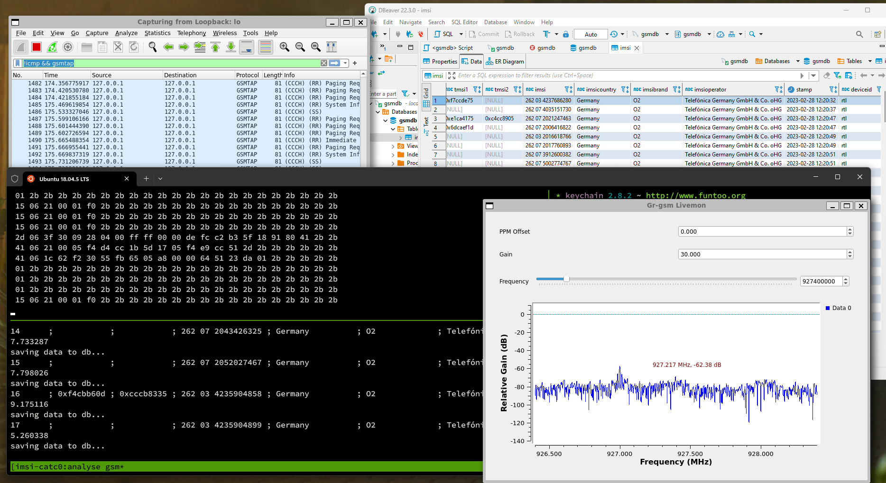

# Setup IMSI Catcher in Docker Container

# Requirements:

- usbipd installed in windows (cmd prompt)
    - installation details here. https://github.com/dorssel/usbipd-win
- usbip client tools installed in WSL Distro (Ubuntu 18.04)
- Software Defined Radio
    - Nooelec NESDR SMArTee XTR SDR (Used for this project)
    - Nice to have sdrs
        - USRP B200, B210, B200mini, N200, N210, X300, X310 devices, with the WBX, SBX, CBX, UBX daughterboards.
        - Lime Microsystems LimeNET Micro (https://wiki.myriadrf.org/LimeNET_Micro)
        - Fairwaves UmTRX and UmSITE (https://umtrx.org/applications/driver/)
    
# In command prompt
In windows install usbipd (for forwarding device to wsl)
    
    # list your devices with BusID, VendorID and ProductID
    usbipd list
    # attach your SDR device to ubuntu  
    usbipd wsl attach --busid 2-1 --distribution Ubuntu-18.04

# In windows wsl2 (Ubuntu)

    sudo apt install linux-tools-virtual hwdata
    sudo update-alternatives --install /usr/local/bin/usbip usbip `ls /usr/lib/linux-tools/*/usbip | tail -n1` 20
    # check the bus and device number by
     lsusb
    # Optional to check if device connected succesfully 
    dmesg | tail
    
# In a DB Client (DBeaver)

connect to mysql db and create a table for gathering gsm traffic

        CREATE TABLE imsi (
            num INT NOT NULL AUTO_INCREMENT,
            id int(11) NOT NULL DEFAULT 0,
            tmsi1 varchar(100) ,
            tmsi2 varchar(100),
            imsi varchar(100),
            imsicountry varchar(100),
            imsibrand varchar(100),
            imsioperator varchar(100),
            stamp datetime,
            deviceid varchar(100),
            cell_id varchar(225),
            lac varchar(225),
            mcc varchar(10),
            mnc varchar(10),
            PRIMARY KEY (num)
        ) ENGINE=InnoDB DEFAULT CHARSET=latin1;

# Run Docker

    docker-compose up -d
    # or
    docker run -d --name gsm-scanner --hostname gsm-scanner --restart unless-stopped --privileged \
        --env DISPLAY=":0" \
        --device=/dev/bus/usb/001/002:/dev/bus/usb/001/002 \
        --volume /tmp/.X11-unix:/tmp/.X11-unix \
        --volume ./env:/catcher/.env:rw \
        --network gsm_net \
        daniyal439/gsm-scanner:v1.0

# Execute
Now run the multi panel terminal for analysing gsm near you

    tmuxp load ./init.yml

# Misc 
Install the x11 server to run GUI apps from wsl or docker containers

    sudo apt install x11-xserver-utils xorg
    # allow from anywhere to connect (used for opening gui from within Container)
    xhost +    
    # for opening multi window terminal 
    sudo apt-get install tmuxp

